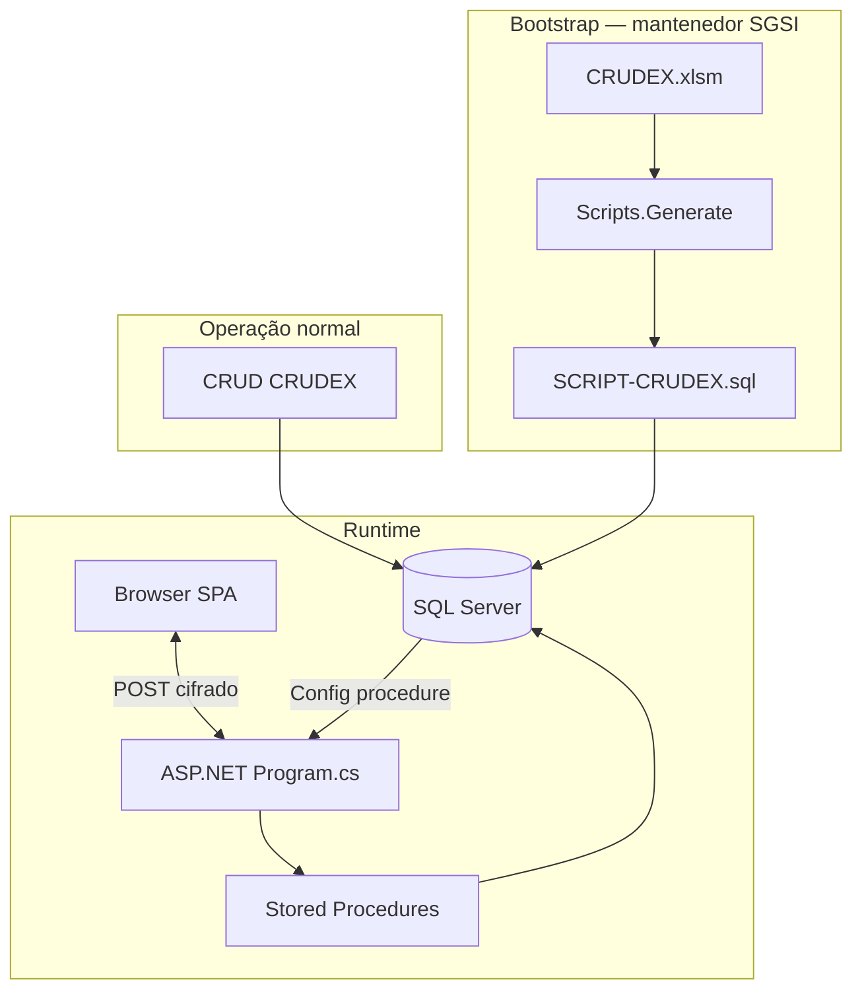

# Documentação do Sistema CRUDEX

Documentação técnica consolidada do repositório **SGSI_CRUDEX**. Última revisão: **junho de 2026**.

> **Público-alvo:** mantenedores, analistas de sistemas e desenvolvedores que trabalham com metadados, runtime ou evolução do CRUDEX.

---

## Índice

1. [Visão geral](#1-visão-geral)
2. [Arquitetura](#2-arquitetura)
3. [Fluxo de metadados](#3-fluxo-de-metadados)
4. [Modelo de metadados 1.0](#4-modelo-de-metadados-10)
5. [Banco de dados e procedures](#5-banco-de-dados-e-procedures)
6. [Gerador SQL](#6-gerador-sql)
7. [Backend ASP.NET](#7-backend-aspnet)
8. [API e contratos JSON](#8-api-e-contratos-json)
9. [Criptografia](#9-criptografia)
10. [Frontend SPA](#10-frontend-spa)
11. [Ciclo CRUD e transações](#11-ciclo-crud-e-transações)
12. [Filtro, pesquisa e ordenação](#12-filtro-pesquisa-e-ordenação)
13. [Integração Wordex](#13-integração-wordex)
14. [Modelo Novíssimo 2.0](#14-modelo-novíssimo-20)
15. [Operação e implantação](#15-operação-e-implantação)
16. [Inventário de componentes](#16-inventário-de-componentes)
17. [Documentação relacionada](#17-documentação-relacionada)

---

## 1. Visão geral

O **CRUDEX** é uma plataforma para construção de sistemas de informação orientados por **metadados**. Em vez de programar telas, grids e formulários tabela a tabela, descreve-se a estrutura do sistema — e o runtime gera dinamicamente a aplicação.

### Princípio central

A inteligência reside no **banco de dados** (stored procedures). C# e JavaScript são camadas finas de apresentação e comunicação.

```
Metadado (banco, via telas) → Procedures → SQL Server ← ASP.NET ← Browser (SPA)
```

### O que o sistema gera automaticamente

| Recurso | Descrição |
|---------|-----------|
| Grids paginados | Colunas `IsListable`, ordenação, navegação |
| Formulários CRUD | Inclusão, alteração, exclusão, consulta |
| Filtro e pesquisa | Campos `IsFilterable`, modo condição Clipper |
| Lookups FK | Dropdowns paginados com descrição amigável |
| Validação | Frontend + procedures `{Table}Validate` |
| Transações | Rascunho (`Persist`) → confirmação (`Commit`) |
| Menu | Itens cadastrados em `Menus` |

### Visão de camadas de informação

```text
Dados (CRUD)  →  Informação (semântica)  →  Apresentação (Wordex)
   tabelas         domínios, queries,           relatório, dashboard,
   transações      regras, metadado             etiqueta, crachá, NF-e, …
```

O CRUDEX cobre **dados** hoje; **Queries** (futuro) ligam à semântica exportável; **Wordex** cobre **apresentação** — tudo metadado, sem projeto por entrega.

### Dois modelos no repositório

| | **Atual (1.0 — em produção)** | **Alvo (2.0 — análise)** |
|--|-------------------------------|--------------------------|
| Planilha | `CRUDEX.xlsm` | `CRUDEX_Novissimo.xlsm` |
| Abas | Nome da tabela (`Categories`) | **Alias** (`Cat`, `Tbl`, `Col`…) |
| Gerador | `Scripts.cs` (T-SQL monolítico) | Novo gerador multi-SGBD |
| SQL válido | `SCRIPT-CRUDEX.sql` | A gerar do Novíssimo |
| FK / pai-filho | `ReferenceTableId`, `ParentTableId` | `Ref` + `Rfk` + `IsParentChild` |

A fase atual da 2.0 é **só análise** — não implementar gerador, procedures nem runtime 2.0 até decisão explícita.

---

## 2. Arquitetura

### Diagrama de componentes



### URL e roteamento

Formato: `/{sistema}.{ambiente}` — ex.: `http://localhost:5000/crudex.dev`

| Método | Rota | Função |
|--------|------|--------|
| `GET` | `/` | Regenera script SQL + página inicial |
| `GET` | `/{sistema}.{ambiente}` | Carrega SPA (`Config.GetHTML`) |
| `POST` | `/{sistema}.{ambiente}` | API JSON cifrada (config, login, execute) |
| `GET` | `/*.class.mjs` | Serve módulos ES do frontend |

Variável de ambiente `CRUDEX_ENVIRONMENT`: `dev` | `hml` | `prd` (1.0).

### Stack tecnológica

| Camada | Tecnologia |
|--------|------------|
| Banco | SQL Server, stored procedures T-SQL |
| Backend | ASP.NET Core, `Microsoft.Data.SqlClient`, Newtonsoft.Json |
| Frontend | JavaScript ES modules (`.class.mjs`), CSS sem framework |
| Metadados | Excel `.xlsm` (bootstrap) + tabelas no banco (operação) |
| Criptografia | AES-256-GCM + RSA-OAEP (transporte); AES mestra (colunas) |
| Relatórios | Wordex (iframe + JSON); `Reports.cs` (OpenXML/LibreOffice — legado) |

---

## 3. Fluxo de metadados

### Fonte de verdade em operação

O fluxo normal de manutenção **não** passa pela planilha:

```
Telas CRUD → Validate → Persist → Commit → banco de metadados
```

A planilha Excel é **bootstrap / carga inicial** e visualização para o mantenedor do SGSI — não é fluxo de cadastro para analistas nem usuários finais.

### Geração de script SQL

`Scripts.Generate()` tem duas fontes (parâmetro `isExcel` / `systemName`):

| Fonte | Quando | Origem dos dados |
|-------|--------|------------------|
| **Excel** | `isExcel=true` ou `systemName=="crudex"` | `ExcelToDataSet()` ← `FILENAME_EXCEL` |
| **Banco** | `isExcel=false` ou outro sistema | `[dbo].[ScriptSystem]` → `GetDataSet()` |

Em operação, a fonte de verdade é **banco + CRUD**; gerar script a partir do banco já existe via `ScriptSystem`.

### Workflow do mantenedor

1. Editar `CRUDEX/StaticFiles/Assets/CRUDEX.xlsm` (ou cadastrar via telas CRUD)
2. `dotnet run -- --generate-script` (ou reiniciar app — `GET /` chama `Scripts.Generate()`)
3. Aplicar `SCRIPT-CRUDEX.sql` no SQL Server
4. Acessar `/{sistema}.{ambiente}` e testar

### Convenções da planilha

- Colunas cujo título começa com **`#`** são lookups Excel (VLOOKUP) — **não** viram coluna física
- Colunas reservadas no gerador: `Data`, `Kind`, `CreatedAt`, `CreatedBy`, `UpdatedAt`, `UpdatedBy`, `UniqueIdentifier`

---

## 4. Modelo de metadados 1.0

### Tabelas físicas (SCRIPT-CRUDEX.sql)

#### Catálogo e tipos

| Tabela | Papel |
|--------|-------|
| `Categories` | Categorias de tipos (`string`, `number`, `date`…); flags `Ask*` |
| `Types` | Tipos lógicos; `CategoryId` |
| `Masks` | Máscaras de entrada (`#` = posição digitável) |
| `Domains` | Tipo lógico + validações + `ValidValues` + `MaskId` |
| `Comparators` | Operadores de filtro (`Symbol`, `Arity`) |
| `Rules` | Quais comparadores cada categoria pode usar |

#### Infraestrutura do sistema

| Tabela | Papel |
|--------|-------|
| `Systems` | Sistema (`Name`, `Prefix`, `MaxRetryLogins`…) |
| `Databases` | Banco lógico |
| `SystemsDatabases` | Liga sistema ↔ banco |
| `Connections` | String de conexão por ambiente |
| `Users` | Usuários |
| `Permissions` | CRUD por `SystemId` + `UserId` + `TableId` |
| `Menus` | Menu: `ParentMenuId` NULL = barra horizontal; filhos = suspenso |
| `Sessions` | Sessão de login (`LoginId`) |
| `Transactions` | Transação aberta no formulário |
| `Operations` | Operações pendentes (JSON rascunho) |

#### Metadado de dados

| Tabela | Papel |
|--------|-------|
| `Tables` | Tabela; `ParentTableId` (pai-filho legado) |
| `DatabasesTables` | Liga banco ↔ tabela |
| `Columns` | Coluna; `DomainId`; `ReferenceTableId` (FK); flags `Is*` |
| `Indexes` / `Indexkeys` | Índices |
| `Unicities` | Unicidade cruzada entre colunas |
| `Expressions` / `Conditions` | Filtros fixos e comportamentos |
| `Properties` / `Behaviors` | Propriedades DOM dinâmicas no form |
| `References` / `Referencekeys` | FK composta (parcialmente no 1.0) |

### Flags importantes em `Columns`

| Flag | Efeito no runtime |
|------|-------------------|
| `IsPrimarykey` | Chave primária |
| `IsAutoIncrement` | Identity / sequência |
| `IsRequired` | Obrigatório na edição |
| `IsListable` | Aparece no grid |
| `IsFilterable` | Participa de filtro/pesquisa |
| `IsEditable` | Editável em incluir/alterar |
| `IsEncrypted` | Cifra AES mestra no servidor |
| `ReferenceTableId` | FK → dropdown + `{Table}List` |

### Domínios e máscaras

- Cada coluna aponta para um **Domain** (`DomainId`), não para `TypeId` diretamente
- Domínio concentra: tipo lógico, tamanho, decimais, `ValidValues` (`;` separados), máscara
- Máscara: cada `#` = posição digitável; validação semântica via `TMask`

### Menu (`Menus`)

| Campo | Papel |
|-------|--------|
| `SystemId` | Menu pertence ao sistema |
| `ParentMenuId` | **NULL** = item na barra horizontal; preenchido = submenu |
| `Sequence` | Ordem de exibição |
| `Caption`, `Message` | Texto do item |
| `Action` | Tabela alvo — só dispara se o item **não tiver filhos** |
| `IsActive` | `false` → item oculto |

---

## 5. Banco de dados e procedures

### Fonte SQL válida

**Somente** `CRUDEX/StaticFiles/db/SCRIPT-CRUDEX.sql` — ignorar outros `.sql` fragmentados (são patches pontuais).

⚠️ O script completo faz `DROP DATABASE` no início. Em ambiente existente, aplicar apenas blocos `ALTER PROCEDURE` necessários.

### Procedures de infraestrutura

| Procedure | Função |
|-----------|--------|
| `Config` | Retorna datasets de metadados para o frontend |
| `Login` | Autenticação, logout, troca de senha |
| `GetPublicKey` | Chave pública RSA do servidor |
| `ScriptSystem` | Exporta metadados para o gerador (fonte banco) |
| `NewId` | Geração de IDs |
| `NewOperationId` | ID de operação pendente |
| `crudex.TransactionBegin` | Abre transação no formulário |
| `crudex.TransactionCommit` | Confirma operações pendentes |
| `crudex.TransactionRollback` | Cancela transação |
| `crudex.IS_EQUAL` | Comparação tipada |
| `crudex.CheckDigit` | Dígito verificador |

### Procedures por tabela `Foo` / `Fooss`

| Procedure | Função |
|-----------|--------|
| `{Singular}Validate` | Valida JSON `@ActualRecord` / `@LastRecord` |
| `{Singular}Persist` | Grava operação pendente (`Operations`) |
| `{Singular}Commit` | Aplica operação confirmada |
| `{Plural}Read` | Lista paginada com filtro JSON |
| `{Plural}List` | Lista simplificada (dropdowns FK) |

### Procedure `Config` — datasets retornados

Índices dos result sets (`@DatabaseName='all'`):

| Índice | Conteúdo |
|--------|----------|
| 0 | Systems |
| 1 | Databases |
| 2 | Tables |
| 3 | Columns |
| 4 | Domains |
| 5 | Types |
| 6 | Categories |
| 7 | Menus |
| 8 | Indexes |
| 9 | Indexkeys |
| 10 | Masks |
| 11 | Unicities |
| 12 | Comparators |
| 13 | Rules |
| 14 | Expressions |
| 15 | Conditions |
| 16 | Properties |
| 17 | Behaviors |
| 18 | References |
| 19 | Referencekeys |

### Contrato `{Table}Read`

Parâmetros típicos:

- `@LoginId` — sessão
- `@RecordFilter` — JSON de filtros
- `@OrderBy` — ordenação
- `@PaddingGridLastPage` — preenche última página
- `@IsActionList` — modo lista (dropdown)
- `@PageNumber`, `@LimitRows`, `@MaxPage` OUT

Retorno: um result set com coluna `result` (JSON da página) + colunas por tabela referenciada (JSON array). Compatível com SGBDs sem múltiplos result sets.

Registros nas procedures: JSON (`@ActualRecord`, `@LastRecord`). Erros: `THROW 51000`, mensagens em português.

---

## 6. Gerador SQL

**Arquivo:** `CRUDEX/Classes/Scripts.cs` (~2.600 linhas)

### Responsabilidades

- Lê planilha Excel (`ExcelDataReader`) ou banco (`ScriptSystem`)
- Emite T-SQL monolítico: `CREATE DATABASE`, tabelas, índices, FKs, procedures
- Gera procedures `Validate`, `Persist`, `Commit`, `Read`, `List` por tabela
- Monta SQL dinâmico de filtro a partir de JSON (`RecordFilter`)
- Integra `ComparatorRegistry` para predicados SQL

### Comandos

```bash
cd CRUDEX
dotnet run -- --generate-script           # DDL + procedures
dotnet run -- --generate-script --with-data  # inclui INSERTs de metadado
```

Saída: `StaticFiles/db/SCRIPT-{DATABASE}.sql` (padrão `SCRIPT-CRUDEX.sql`).

### Ponte Novíssimo

`NovissimoExcel.cs` — leitura da planilha `CRUDEX_Novissimo.xlsm` (futuro).  
`RenameExcelSheetsByTableAlias()` — renomeia abas `Cat`→`Categories` quando existe aba `Tbl`.

---

## 7. Backend ASP.NET

### Arquivos principais

| Arquivo | Papel |
|---------|-------|
| `Program.cs` | Host, rotas, middleware `.mjs`, orquestração API |
| `Settings.class.cs` | Leitura `appsettings.json` + variáveis de ambiente |
| `Config.class.cs` | Monta objeto `Config` para o frontend |
| `Procedure.cs` | Executa stored procedures via `SqlCommand` |
| `Login.class.cs` | Autenticação, serialização de login |
| `Api.class.cs` | Cifra/decifra request/response |
| `RecordCrypto.class.cs` | Cifra colunas `IsEncrypted` em persist/read |
| `TransportCrypto.class.cs` | AES-GCM + RSA (servidor) |
| `ComparatorRegistry.cs` | Predicados SQL por `Symbol` + `Arity` |
| `Scripts.cs` | Gerador SQL |
| `Reports.cs` | Geração DOCX/PDF (OpenXML + LibreOffice) |
| `Styles.class.cs` / `Images.class.cs` | CSS e ícones injetados no HTML |
| `Actions.cs` | Constantes de ações (`config`, `read`, `persist`…) |

### Fluxo de uma requisição POST

```
1. POST /{sistema}.{ambiente}
2. Api.ResolveRequestAesKey → decifra envelope transporte
3. Parse JSON: { Login, Parameters }
4. Parameters.Action:
   - config  → Config.Create(systemName, "all")
   - login/logout/change → Login.Execute
   - read/persist/commit/… → Login (sessão) + Procedure.Execute
5. Api.WriteJsonResponse → cifra resposta com RSA do cliente
```

Ações `read`, `persist`, `commit` embutem JSON de login em `InParams.Login` (substituem `LoginId` isolado).

---

## 8. API e contratos JSON

### Estrutura do POST

```json
{
  "Request": "<envelope cifrado ou JSON em claro (só config)>",
  "Ek": "<RSA-OAEP da chave AES — quando cifrado>"
}
```

Corpo decifrado:

```json
{
  "Login": {
    "Action": "login",
    "SystemName": "crudex",
    "UserName": "...",
    "Password": "...",
    "ClientRsaPublicKey": "...",
    "PublicKey": "..."
  },
  "Parameters": {
    "Action": "execute",
    "DatabaseName": "crudex",
    "TableName": "Categories",
    "Action": "read",
    "InParams": { "LoginId": 1, "RecordFilter": "...", "OrderBy": "Name" },
    "IOParams": { "PageNumber": 1, "LimitRows": 35, "MaxPage": 0 }
  }
}
```

> Nota: `Parameters.Action` interno indica a operação da procedure (`read`, `persist`, `commit`, `create`, `update`, `delete`, `begin`, `rollback`).

### Ações disponíveis (`Actions.cs`)

| Constante | Uso |
|-----------|-----|
| `config` | Carrega metadados |
| `login` / `logout` / `change` | Autenticação |
| `read` | `{Table}Read` |
| `persist` | `{Table}Persist` |
| `commit` | `{Table}Commit` + `TransactionCommit` |
| `begin` / `rollback` | Transação |
| `create` / `update` / `delete` | Ações de operação |

### Formato `@RecordFilter` (1.0)

```json
{
  "Filter": { "Name": "valor", "ReferenceTableId": null },
  "Fixed": { "TableId": 5 },
  "Id": 10
}
```

| JSON | SQL gerado |
|------|------------|
| Chave **ausente** | Critério ignorado |
| `"campo": null` | `AND [T].[campo] IS NULL` |
| `"campo": true/false` | Igualdade bit |
| `"campo": "texto"` | Igualdade |
| `"$._": [1,2,3]` | Lista de IDs selecionados |

Chaves em `$.Filter`, `$.Fixed` ou na **raiz plana** são reconhecidas.

---

## 9. Criptografia

Uma única primitiva (`TransportCrypto` em C# e JS): **AES-256-GCM** com envelope JSON v1.

### Transporte API

| Aspecto | Detalhe |
|---------|---------|
| Conteúdo cifrado | JSON inteiro de request/response |
| `ek` | Sempre presente (RSA-OAEP) |
| Chave AES | Por mensagem; `ek` embrulha com RSA do **destinatário** |
| RSA servidor | Par fixo (`RSA_PRIVATE_KEY` / `RSA_PUBLIC_KEY`) |
| RSA cliente | Par gerado **por carga da SPA**; pública no login |
| Direção | Request → pública do servidor; Response → pública do cliente |

Envelope: `{ "v": 1, "ek", "iv", "t", "d" }`

### Colunas `IsEncrypted`

| Aspecto | Detalhe |
|---------|---------|
| Conteúdo | Valor do campo (string) |
| `ek` | Não |
| Chave | **Mestra** (`DATA_ENCRYPTION_KEY`) |
| Envelope | `{ "v", "iv", "t", "d" }` sem `ek` |

`RecordCrypto` cifra `ActualRecord`/`LastRecord` no persist e decifra o `DataSet` no read. O frontend recebe valores em claro dentro do transporte cifrado.

### Configuração

| Chave | Uso |
|-------|-----|
| `DATA_ENCRYPTION_KEY` | Base64, 32 bytes — colunas |
| `RSA_PRIVATE_KEY` / `RSA_PUBLIC_KEY` | PKCS#8 / SPKI base64 — transporte |

`Settings.Get` prioriza variável de ambiente. Se ausente ou inválida, o servidor **gera e grava** na primeira inicialização.

---

## 10. Frontend SPA

### Bootstrap (`TSystem.class.mjs`)

1. `TConfig.GetAPI("config")` — metadados + estilos + RSA pública
2. `TransportCrypto.Initialize` — prepara cifra
3. Instancia catálogos: `TCategory`, `TType`, `TDomain`, `TMask`, `TComparator`, `TReference`…
4. Monta hierarquia `TDatabase` → `TTable` → `TColumn`
5. `TLogin` → `TMenu` → navegação

### Classes de metadado em memória

| Classe | Papel |
|--------|-------|
| `TSystem` | Orquestrador; catálogos; roteamento de telas |
| `TConfig` | HTTP API, parse de datasets, timeout de sessão |
| `TDatabase` / `TTable` / `TColumn` | Espelho do metadado |
| `TDomain` / `TType` / `TCategory` | Tipos e validações |
| `TMask` | Máscaras de entrada e dígito verificador |
| `TReference` | FK e referências |
| `TComparator` / `TCondition` | Operadores de filtro |
| `TExpression` | Avaliação de expressões |
| `TProperty` | Propriedades DOM (comportamentos) |

### Classes de UI

| Classe | Papel |
|--------|-------|
| `TScreen` | Container principal da aplicação |
| `TMenu` | Menu horizontal + submenus |
| `TBrowse` | Grid paginado, toolbar, filtro/pesquisa |
| `TForm` | Formulários CRUD, filtro, pesquisa |
| `TEditBox` | Campo unificado por tipo de coluna |
| `TDropdown` | Single, multi, addable (IN), cardinality (BETWEEN) |
| `TCheckbox` | Edição e modo condição (nulo/ignorar) |
| `TLogin` | Tela de autenticação |
| `TDialog` | Diálogos de erro/confirmação |
| `TSpinner` | Indicador de carregamento |
| `TScrollBar` | Scrollbar customizada do grid |

### Leitura de dados

| Classe | Papel |
|--------|-------|
| `TRecordSet` | Paginação, filtro, `goPage`, `nextRow`, chama `{Table}Read` |
| `TRecord` | Uma linha; escalares + `references.{alias}.campo` |
| `TListValues` | Espelho em memória de `TRecordSet` para `ValidValues` |
| `TDataset` | Parse de datasets retornados |
| `TTransaction` | Ciclo persist/commit/rollback |

### Mapeamento HTML por categoria

`TCategoryHtml.class.mjs` — mapeia `Category.Name` → `input` / `checkbox` / `textarea` / alinhamento. Substitui colunas `HtmlInputType` / `HtmlInputAlign` removidas do fluxo runtime.

### Modos do `TDropdown`

| Factory | Uso |
|---------|-----|
| `TDropdown.Single` | FK / lista paginada, um item |
| `TDropdown.Multi` | Vários itens (checkbox na lista) |
| `TDropdown.Addable` | Operador IN — digitar e incluir com `+` |
| `TDropdown.Cardinality` | BETWEEN — exatamente 2 valores |

`TRecordSet.readPickerPage` alimenta FK; `TListValues.readPickerPage` alimenta `ValidValues`.

### Estilos

Pasta: `StaticFiles/Assets/Styles/`

| Arquivo | Escopo |
|---------|--------|
| `main.css` | Variáveis globais, cores, botões |
| `grid.css` | Grid e linha selecionada (`currentRow`) |
| `form.css` | Formulários |
| `dropdown.css` | Listas suspensas |
| `checkbox.css` | Checkboxes |
| `login.css` / `menu.css` / `screen.css` | Telas específicas |
| `dialog.css` / `spinner.css` / `scrollbar.css` | Componentes |

---

## 11. Ciclo CRUD e transações

### Fluxo no formulário

```
1. Abrir form (incluir/alterar/excluir)  →  TransactionBegin  →  Transactions
2. Persistir                              →  Validate + Persist  →  Operations (pendente)
3. Confirmar                              →  TransactionCommit   →  {Table}Commit de cada Ope
4. Cancelar                               →  TransactionRollback
```

Várias operações podem ser persistidas na mesma transação antes do commit.

**Inclusão:** após Confirmar com sucesso, o formulário é **remontado vazio** para nova inclusão.

### Tabelas envolvidas

| Tabela | Conteúdo |
|--------|----------|
| `Sessions` | `LoginId`, usuário, sistema, chave pública |
| `Transactions` | Transação aberta (`SessionId`) |
| `Operations` | `TableName`, `Action`, `LastRecord`, `ActualRecord` (JSON), `IsConfirmed` |

---

## 12. Filtro, pesquisa e ordenação

### Modo condição (estilo Clipper)

| Estado | Aparência | Efeito |
|--------|-----------|--------|
| **Ignorar** | Campo vazio | Critério não entra na consulta |
| **Nulo** | Placeholder "nulo" | `IS NULL` |
| **Sim / Não** | Checkbox ✓ / ✗ | Igualdade booleana |
| **Valor** | Texto, número ou lista | Igualdade (filtro) ou contém (pesquisa) |

### Diferença filtro vs pesquisa

| | **Filtro** | **Pesquisa** |
|--|------------|--------------|
| Escopo | Recarrega do **servidor** (`{Table}Read`) | Percorre **página atual** |
| Texto | Igualdade exata | Contém (LIKE) |

### Comparadores

Metadado (`Comparators` + `Rules`) define catálogo. Implementação:

| Camada | Arquivo |
|--------|---------|
| JavaScript | `TComparator.class.mjs` — `buildJs`, `parseValues` |
| C# / SQL | `ComparatorRegistry.cs` — `BuildSqlPredicate` |

**Pendente:** SQL por engine (`Eng`) no registry — hoje só T-SQL.

### Ordenação

Clique no cabeçalho do grid alterna ASC/DESC. **Desordenar** (Alt+O) restaura ordem padrão.

---

## 13. Integração Wordex

### Papel de cada sistema

| | **CRUDEX** | **Wordex** |
|--|------------|------------|
| Função | Dados, telas, regras, JSON | Template, layout, paginação, PDF |
| Entrada | Metadado + Query (árvore) | Template HTML + JSON |
| Saída | JSON Wordex | HTML paginado + PDF |

### Fluxo planejado

```
Menu → grid Reports → CRUDEX executa Query → JSON Wordex
     → iframe com template (Reports.Template) → ObterPDF(json) → PDF
```

### Tabelas de metadado (a criar / em evolução)

| Tabela | Conteúdo |
|--------|----------|
| `Reports` | Template HTML autossuficiente (Wordex) |
| `Queries` | Tabela raiz + relações pai-filho/FK → árvore JSON |

### Regra Kind / Category

**Kind no JSON = `Categories.Name`**. Vetor → `collection`; objeto → `object`; senão Category explícita.

### API iframe

```javascript
const pdf = await iframe.contentWindow.ObterPDF(json);

// ou postMessage:
// → { type: "wordex-obter-pdf", id, json, options }
// ← { type: "wordex-obter-pdf-result", ok, dataUri, fileName }
```

### Legado no backend

`Reports.cs` — geração DOCX via OpenXML + conversão PDF com LibreOffice (`LIBRE_OFFICE_COMMAND` em `appsettings.json`). Caminho distinto do Wordex iframe.

Documentação detalhada: [.cursor/skills/wordex/SKILL.md](.cursor/skills/wordex/SKILL.md)

---

## 14. Modelo Novíssimo 2.0

Especificação: `CRUDEX/StaticFiles/Assets/CRUDEX_Novissimo.xlsm` (**39** tabelas e crescendo).

### Hierarquia operacional

```
Db (Database — ápice)
  → Sys (Systems)
  → Env (Environments — cadeia linear)
  → Con (Connections)
  → Tbl → Col → …
  → Mnu (menu por SystemId)

Cat → Typ → Map (× Eng de Own)
Own → Dmn (+ Mkg → Msk)
Ref (FK + IsParentChild) | Exp → Cnd | Bhv | Snp → Scr/Url
```

### Principais mudanças vs 1.0

| Área | Atual | Novíssimo |
|------|-------|-----------|
| Tipos SQL | `#DataType` fixo T-SQL | `Map` × `Own.EngineId` |
| FK | `ReferenceTableId`, `ParentTableId` | `Ref` + `Rfk` + `IsParentChild` |
| Menu | `Menus` | `Mnu` (= modelo 1.0, separado de `Tbl`) |
| Owners | Não existe | `Own` — `OwnerId IN (1, @SessionOwnerId)` |
| Multi-SGBD | Só SQL Server | `Eng` + providers |
| Filtro grid | Igualdade + IS NULL | Operadores `Cmp` (AND) |
| Comportamentos | Hardcode em `TForm` | `Prp` / `Bhv` declarativos |
| Master-detail | Não existe | `Ref.IsParentChild` |
| Agendamento | — | `Sch` + `Snp` → `Scr` / `Url` |

### Status

**Só análise** — não codificar gerador, procedures nem runtime 2.0 até o metamodelo estabilizar.

Referência aba a aba: [.cursor/skills/crudex/reference.md](.cursor/skills/crudex/reference.md)

### Gaps de implementação (prioridade)

1. ✅ `TRecordSet` + `TRecord` (v1)
2. ✅ `TBrowse` delega ao `TRecordSet`
3. ✅ `TDropdown` (single, multi, addable, cardinality)
4. ✅ `TListValues` para `ValidValues`
5. ⬜ Gerador SQL Novíssimo
6. ⬜ `Ref` + master-detail no `TForm`
7. ⬜ `{Table}Read` com JSON + `Cmp`
8. ⬜ `Prp`/`Bhv` no form
9. ⬜ `Sch`/`Snp` → `Scr`/`Url`
10. ⬜ Comparadores SQL por engine

---

## 15. Operação e implantação

### Requisitos

- .NET SDK (versão do `CRUDEX.csproj`)
- SQL Server com banco `crudex`
- `SCRIPT-CRUDEX.sql` aplicado
- `ConnectionString` em `appsettings.json` ou variável de ambiente

### Subir a aplicação

```bash
cd CRUDEX
dotnet run
```

Acesso: `http://localhost:5000/crudex.dev` (porta conforme `launchSettings.json`).

### Configuração (`appsettings.json`)

| Chave | Uso |
|-------|-----|
| `ConnectionString` | SQL Server |
| `CONFIG_PROCEDURE` | Nome da procedure de config (`Config`) |
| `FILENAME_EXCEL` | Planilha de metadados |
| `ROWS_PER_PAGE` | Linhas por página no grid |
| `ROWS_PER_DROPDOWN_PAGE` | Itens por página em dropdowns |
| `ROWS_PER_CHILD_PAGE` | Linhas em grids filhos (futuro) |
| `PADDING_GRID_LAST_PAGE` | Preenche última página do grid |
| `REVERSE_ITEMS_WHEN_OPEN_UP` | Inverte ordem visual em dropdown que abre para cima |
| `IDLE_TIME_IN_MINUTES_LIMIT` | Timeout de sessão |
| `DIRECTORY_SCRIPTS` | Pasta de saída do SQL gerado |
| `DIRECTORY_STYLES` / `DIRECTORY_IMAGES` | Assets estáticos |
| `DATA_ENCRYPTION_KEY` | Chave mestra (colunas) |
| `RSA_PRIVATE_KEY` / `RSA_PUBLIC_KEY` | Par RSA (transporte) |
| `LIBRE_OFFICE_COMMAND` | Conversão PDF (legado) |

### Depuração

1. Identificar tabela e ação → procedure em `SCRIPT-CRUDEX.sql`
2. Reproduzir JSON (`RecordFilter`, `@ActualRecord`, `@LastRecord`)
3. Verificar `@LoginId` e transação aberta (`Transactions` / `Operations`)
4. Erros: `THROW 51000` com mensagem em português

### Estrutura do repositório

```
SGSI_CRUDEX/
├── README.md
├── MANUAL.md                    # Manual usuário + desenvolvedor
├── DOCUMENTACAO.md              # Este arquivo
├── ESTADO-ATUAL.md              # Retrato do projeto (jun/2026)
├── CRUDEX/
│   ├── Program.cs
│   ├── appsettings.json
│   ├── CRUDEX.csproj
│   ├── Classes/                 # Backend C#
│   └── StaticFiles/
│       ├── Assets/
│       │   ├── CRUDEX.xlsm
│       │   ├── CRUDEX_Novissimo.xlsm
│       │   ├── Images/
│       │   └── Styles/
│       ├── Classes/             # Frontend (*.class.mjs)
│       ├── Components/          # TScreen, TDialog
│       ├── db/
│       │   └── SCRIPT-CRUDEX.sql
│       └── testes/              # HTML/JS de teste isolados
└── .cursor/skills/
    ├── crudex/                  # Skill + reference Novíssimo
    └── wordex/                  # Skill Wordex
```

---

## 16. Inventário de componentes

### Backend C# (20 arquivos)

`Program.cs`, `Actions.cs`, `Api.class.cs`, `Config.class.cs`, `Settings.class.cs`, `Procedure.cs`, `Login.class.cs`, `Scripts.cs`, `NovissimoExcel.cs`, `RecordCrypto.class.cs`, `TransportCrypto.class.cs`, `ComparatorRegistry.cs`, `Reports.cs`, `Styles.class.cs`, `Images.class.cs`, `ReferenceModel.cs`, `Models/Error.model.cs`, `Models/TResult.cs`

### Frontend JS (35 classes + 2 componentes)

**Metadado:** `TSystem`, `TConfig`, `TDatabase`, `TTable`, `TColumn`, `TDomain`, `TType`, `TCategory`, `TCategoryHtml`, `TMask`, `TIndex`, `TIndexkey`, `TReference`, `TComparator`, `TCondition`, `TExpression`, `TProperty`, `TField`

**UI:** `TScreen`, `TMenu`, `TBrowse`, `TForm`, `TEditBox`, `TDropdown`, `TCheckbox`, `TLogin`, `TDialog`, `TSpinner`, `TScrollBar`

**Dados:** `TRecordSet`, `TRecord`, `TListValues`, `TDataset`, `TTransaction`

**Segurança:** `TransportCrypto`

**Componentes:** `TScreen.component.mjs`, `TDialog.component.mjs`

### Tabelas no banco (1.0) — 28 entidades

`Categories`, `Types`, `Masks`, `Domains`, `Systems`, `Menus`, `Users`, `Permissions`, `Connections`, `Databases`, `SystemsDatabases`, `Tables`, `DatabasesTables`, `Columns`, `Indexes`, `Indexkeys`, `Sessions`, `Transactions`, `Operations`, `Unicities`, `Comparators`, `Rules`, `Expressions`, `Conditions`, `Properties`, `Behaviors`, `References`, `Referencekeys`

---

## 17. Documentação relacionada

| Documento | Conteúdo | Público |
|-----------|----------|---------|
| [README.md](README.md) | Visão geral e links | Todos |
| [MANUAL.md](MANUAL.md) | Manual do usuário (grid, form, atalhos) + desenvolvedor | Usuário + dev |
| [ESTADO-ATUAL.md](ESTADO-ATUAL.md) | Retrato jun/2026, pendências, como retomar | Mantenedor |
| [.cursor/skills/crudex/SKILL.md](.cursor/skills/crudex/SKILL.md) | Regras para agentes Cursor; arquitetura | IA + dev |
| [.cursor/skills/crudex/reference.md](.cursor/skills/crudex/reference.md) | Referência aba a aba do Novíssimo | Analista + dev |
| [.cursor/skills/wordex/SKILL.md](.cursor/skills/wordex/SKILL.md) | Integração Wordex ↔ CRUDEX | Dev relatórios |

### Atalhos de teclado (resumo)

Ver seção completa em [MANUAL.md — Atalhos](MANUAL.md#atalhos-de-teclado).

| Contexto | Atalho | Ação |
|----------|--------|------|
| Grid | Alt+I/A/E/V | Incluir / Alterar / Excluir / Ver |
| Grid | Alt+F/L/O/X | Filtrar / Desfiltrar / Desordenar / Sair |
| Grid | Enter | Alterar registro selecionado |
| Form | Esc | Cancelar (ou sair em consulta) |

---

*SoftLab / SGSI — CRUDEX 1.0 + especificação Novíssimo 2.0*
