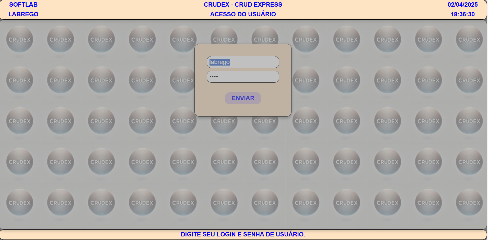
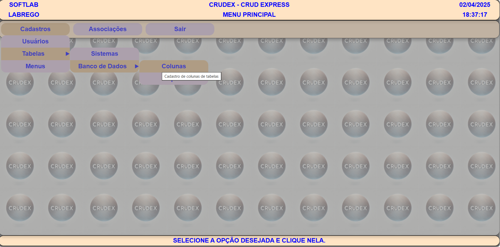
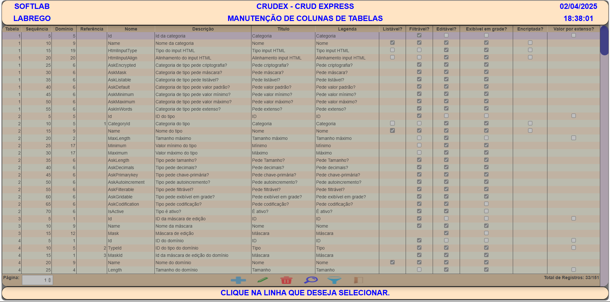
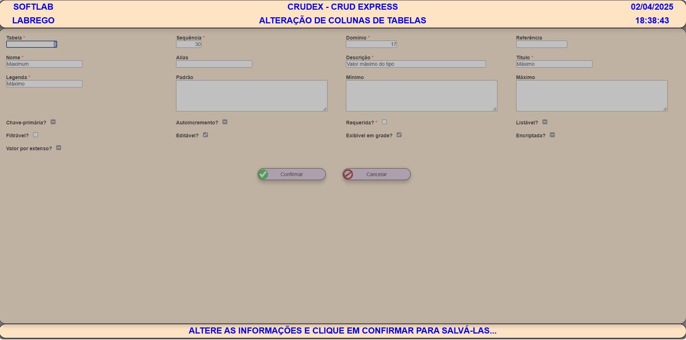

CRUDEX: O SGSI mais poderoso do mundo

CONTATO: João da Rocha Labrego — joaolabrego@gmail.com

O projeto CRUDEX, que já está quase em fase final de desenvolvimento, foi criado para automatizar ao máximo o desenvolvimento de sistemas.

Tive até que inventar um conceito novo para defini-lo: SGSI — Sistema Gerenciador de Sistemas de Informação.

Assim como existem os conceitos de SGBD SQL e SGBD No-SQL, agora existe também o conceito de SGSI CRUDEX. Se futuramente surgirem outros padrões, haverá os SGSI CRUDEX e os SGSI No-CRUDEX.

O que há de novo nisso?

No CRUDEX, o analista de negócios especifica o sistema diretamente, definindo tabelas, validações, índices, chaves estrangeiras, chaves primárias etc.

Com base nesses metadados, o CRUDEX gera automaticamente todos os scripts DDL e DML necessários, bem como as stored procedures responsáveis pelas operações de CRUD de cada tabela.

O sistema também fornece um frontend padrão — feito em HTML, CSS e JavaScript puro (sem frameworks) — em arquitetura Single Page Application e montado dinamicamente no navegador conforme os metadadados configurados para o sistema em execução.

Com isso, o analista de negócios já pode executar e testar o sistema especificado imediatamente, bastando criar o banco de dados com os scripts gerados automaticamente.

Desse modo, toda a inteligência do sistema reside no banco de dados, incluindo as regras de negócio.

O analista de negócios deixa de depender do desenvolvedor para validar suas especificações e, caso o frontend padrão atenda às necessidades, o sistema já pode ser considerado pronto para uso.

Se o cliente desejar um frontend mais bonito ou personalizado, o desenvolvedor entra em ação apenas para construir essa interface, desde que as operações de CRUD sejam realizadas via API — nunca diretamente no banco.

Com isso, o backend passa a ser responsabilidade do analista de negócios ou do DBA — e não mais do desenvolvedor.

Ao desenvolvedor cabe apenas a criação de frontends específicos, como aplicativos móveis ou interfaces avançadas, sem interferir na lógica do sistema.

O CRUDEX já conta com várias funcionalidades adicionais, mas o essencial é esse.

IMAGENS DO FRONTEND PADRÃO

